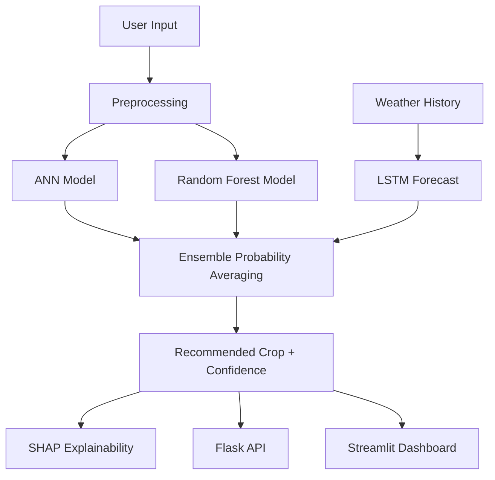

# Smart Crop Recommendation & Decision Support System

## 1. Executive Summary

This project is an end-to-end AI system that recommends the most suitable crop based on soil and weather conditions.

It combines:

- A hybrid crop predictor (ANN + Random Forest ensemble)
- A weather forecasting model (LSTM)
- Explainability using SHAP
- A Flask backend API
- A Streamlit frontend dashboard

The goal is to support data-driven crop planning with transparent model reasoning.

---

## 2. Problem Statement

Farmers often choose crops using experience-based decisions. This can lead to:

- Lower yield
- Poor nutrient utilization
- Reduced profitability

This system uses machine learning to map environmental and soil features to crop classes and produce explainable recommendations.

---

## 3. Input and Output

### Input Features

- `N` (Nitrogen)
- `P` (Phosphorus)
- `K` (Potassium)
- `temperature`
- `humidity`
- `ph`
- `rainfall`

### Output

- `recommended_crop`
- `confidence` score
- `explanation` (top feature contributions)

---

## 4. Dataset

Primary training dataset:

- `data/crop_dataset.csv`

Additional raw datasets:

- `datasets/Crop_recommendation.csv`
- `datasets/Crop Recommendation using Soil Properties and Weather Prediction.csv`

Main supervised target:

- `label` (22 crop classes)

---

## 5. System Architecture



---

## 6. Module-by-Module Explanation

### 6.1 Preprocessing

File: `preprocessing/preprocess.py`

Responsibilities:

- Load dataset with pandas
- Handle missing values
- Feature scaling with `StandardScaler`
- Label encoding + one-hot encoding
- Train/test split (stratified)
- Persist inference artifacts (`scaler`, `label_encoder`)

Core outputs:

- `X_train`, `X_test`, `y_train`, `y_test`

### 6.2 ANN Model

File: `models/ann_model.py`

Architecture:

- Input: 7 features
- Dense(64, ReLU)
- Dense(32, ReLU)
- Output: 22 classes (Softmax)

Training config:

- Loss: `categorical_crossentropy`
- Optimizer: `adam`
- Metric: `accuracy`
- Callbacks: early stopping + learning rate reduction

Saved artifact:

- `models/ann_model.h5`

### 6.3 Random Forest Model

File: `models/random_forest.py`

Configuration:

- `n_estimators=200`
- `max_depth=None`

Saved artifact:

- `models/artifacts/random_forest.joblib`

### 6.4 Ensemble Layer

File: `models/ensemble_model.py`

Method:

- Load ANN and Random Forest
- Get class probabilities from both
- Average probabilities
- Choose class with highest averaged confidence

Returns:

- Recommended crop
- Confidence
- Class probability distribution

### 6.5 Weather Forecasting Model

File: `models/weather_lstm.py`

Purpose:

- Forecast future weather signals from historical weather
- Uses temperature and rainfall time-series

Model:

- LSTM-based sequence model
- Forecast output: next temperature and rainfall values

Saved artifacts:

- `models/weather_lstm.keras`
- `models/artifacts/weather_scaler.joblib`

### 6.6 Explainability

File: `explainability/shap_explainer.py`

Method:

- SHAP `TreeExplainer` over Random Forest model
- Returns top contributing features for a prediction
- Supports chart generation for UI display

### 6.7 Backend API

File: `api/app.py`

Endpoints:

- `GET /health`
- `POST /predict`

`POST /predict` returns:

- crop recommendation
- confidence
- SHAP-style top feature contribution values

Supports optional weather forecast injection when historical weather is supplied.

### 6.8 Frontend Dashboard

File: `dashboard/streamlit_app.py`

Features:

- Dark-themed UI
- Input controls for all agronomic features
- `Flask API` mode (recommended for production)
- `Local Models` mode (fallback for local/offline testing)
- SHAP contribution chart
- Probability chart for top classes
- Optional weather forecast assist

---

## 7. Training and Validation Status

End-to-end training pipeline has been executed:

1. ANN training completed
2. Random Forest training completed
3. Weather LSTM training completed

Observed metrics from run:

- ANN test accuracy: `0.9818`
- Random Forest test accuracy: `0.9955`

Artifact integrity was verified by loading all model/scaler files and running sample inference.

---

## 8. Saved Artifacts

- `models/ann_model.h5`
- `models/weather_lstm.keras`
- `models/artifacts/random_forest.joblib`
- `models/artifacts/scaler.joblib`
- `models/artifacts/label_encoder.joblib`
- `models/artifacts/weather_scaler.joblib`

---

## 9. API Example

### Request

```json
{
  "N": 90,
  "P": 42,
  "K": 43,
  "temperature": 25,
  "humidity": 80,
  "ph": 6.5,
  "rainfall": 200
}
```

### Response

```json
{
  "recommended_crop": "jute",
  "confidence": 0.5426,
  "explanation": {
    "N": 0.1124,
    "K": 0.0910,
    "P": 0.0795
  }
}
```

---

## 10. How to Run

### Install dependencies

```bash
pip install -r requirements.txt
```

### Train models

```bash
python -m models.ann_model
python -m models.random_forest
python -m models.weather_lstm
```

### Run backend API

```bash
python -m api.app
```

### Run frontend

```bash
streamlit run dashboard/streamlit_app.py
```

---

## 11. Production Notes

- Recommended architecture: Streamlit frontend calling Flask API.
- This deployment pattern separates UI and model serving concerns.
- API-first design enables reuse by web/mobile/third-party clients.

GPU note:

- System GPU is available (`RTX 3060`), but current TensorFlow build in this environment is CPU-only.
- To use CUDA acceleration, install a CUDA-enabled TensorFlow stack compatible with your OS and Python setup.

---

## 12. Current Repository Layout

```text
api/
dashboard/
data/
datasets/
explainability/
models/
preprocessing/
utils/
README.md
PROJECT_EXPLANATION.md
requirements.txt
```

---

## 13. Future Improvements

- Profit optimization module integration
- Robust automated tests (unit + integration)
- Model/version registry and experiment tracking
- Auth, rate limiting, and monitoring for API
- Containerized deployment (Docker + reverse proxy)

---

## 14. Conclusion

This project is a complete, modular, production-style ML system for crop recommendation with explainable outputs, weather assistance, and full-stack deployment readiness.