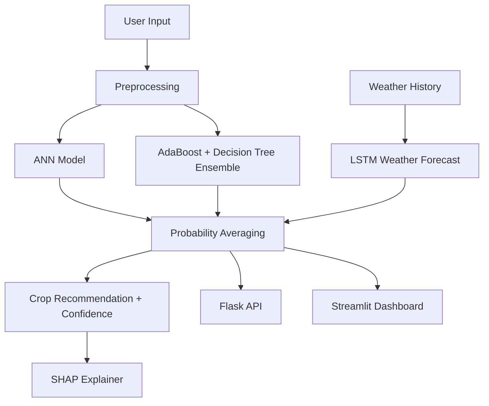

# Smart Crop Recommendation & Decision Support System

Production-style machine learning system that recommends the best crop using soil nutrients, weather conditions, and soil pH.

## Core Capabilities

- Crop recommendation using 7 agronomic features (`N`, `P`, `K`, `temperature`, `humidity`, `ph`, `rainfall`)
- Hybrid prediction engine with AdaBoost + Decision Tree probability ensemble
- Weather forecasting with LSTM (temperature and rainfall)
- Explainable AI using SHAP feature attributions
- Flask API for serving predictions
- Streamlit dashboard for interactive usage

## Project Structure

```text
project-root/
|-- data/
|   `-- crop_dataset.csv
|-- models/
|   |-- ann_model.py
|   |-- random_forest.py
|   |-- ensemble_model.py
|   |-- weather_lstm.py
|   `-- artifacts/
|-- preprocessing/
|   `-- preprocess.py
|-- explainability/
|   `-- shap_explainer.py
|-- api/
|   `-- app.py
|-- dashboard/
|   `-- streamlit_app.py
|-- utils/
|   `-- helpers.py
|-- notebooks/
|-- requirements.txt
`-- README.md
```

## Architecture



## Dataset

- Source: Kaggle Crop Recommendation Dataset
- Canonical training file: `data/crop_dataset.csv`
- Features: `N`, `P`, `K`, `temperature`, `humidity`, `ph`, `rainfall`
- Target: `label` (22 crop classes)

## Setup

1. Create virtual environment (recommended).
2. Install dependencies:

```bash
pip install -r requirements.txt
```

## CUDA / RTX 3060 Notes

TensorFlow GPU support is enabled in code via `configure_tensorflow_gpu()` in `utils/helpers.py`.

- Ensure NVIDIA driver and CUDA-compatible TensorFlow are installed.
- On startup, training scripts print whether GPU is detected.
- If GPU is not available, training automatically falls back to CPU.

## Training Pipeline

Run from project root in this order:

```bash
python -m models.ann_model
python -m models.ensemble_model
python -m models.weather_lstm
```

This pipeline saves:

- `models/ann_model.h5`
- `models/weather_lstm.keras`
- `models/artifacts/decision_tree.joblib`
- `models/artifacts/adaboost.joblib`
- `models/artifacts/scaler.joblib`
- `models/artifacts/label_encoder.joblib`
- `models/artifacts/weather_scaler.joblib`

## Synthetic Data Augmentation

The training pipeline now supports mild synthetic augmentation on the training split only.

What it does:

- Generates additional rows by applying small Gaussian perturbations to existing training samples
- Clips values to the observed feature range to keep samples realistic
- Leaves the test split untouched so evaluation stays fair

This is enabled in the ANN and ensemble training scripts by default to help improve generalization and the confidence of predictions.
Confidence improvements are sample-dependent, so the main benefit is usually better calibration and robustness rather than a guaranteed higher score for every prediction.

## API Usage

Run API server:

```bash
python -m api.app
```

### Endpoint

- `POST /predict`

### Request Example

```json
{
  "N": 90,
  "P": 42,
  "K": 43,
  "temperature": 25,
  "humidity": 80,
  "ph": 6.5,
  "rainfall": 200
}
```

### Response Example

```json
{
  "recommended_crop": "rice",
  "confidence": 0.92,
  "explanation": {
    "rainfall": 0.32,
    "humidity": 0.18,
    "temperature": 0.11
  }
}
```

### Optional Weather Forecast Input

You can request weather-augmented prediction by adding:

- `"use_weather_forecast": true`
- `"historical_weather": [{"temperature": 24.8, "rainfall": 180}, ...]`

## Dashboard Usage

Run Streamlit dashboard:

```bash
streamlit run dashboard/streamlit_app.py
```

Features:

- Sliders for soil and weather features
- Predict button
- Recommended crop + confidence
- SHAP contribution chart
- Optional LSTM weather forecast integration

## Model Metrics

The table below documents the tree-based ensemble metrics used by the current production pipeline.
Metrics were captured on the current 80/20 holdout split.

| Model | Test Accuracy | Notes |
| --- | --- | --- |
| Decision Tree | 0.9750 | Single-tree baseline used in the ensemble |
| AdaBoost | 0.9955 | Boosted tree classifier used in the ensemble |
| Final Ensemble | 0.9750 | Probability average of Decision Tree and AdaBoost |

## Engineering Notes

- Clean modular structure by layer (preprocessing, modeling, explainability, serving)
- Reproducibility with global seed setting
- Shared artifact management and path constants in `utils/helpers.py`
- Type hints and docstrings in core modules

## Future Enhancements

- Add model versioning and metadata registry
- Add unit/integration tests and CI pipeline
- Add authentication and rate-limiting to API
- Add profit optimization model integration
